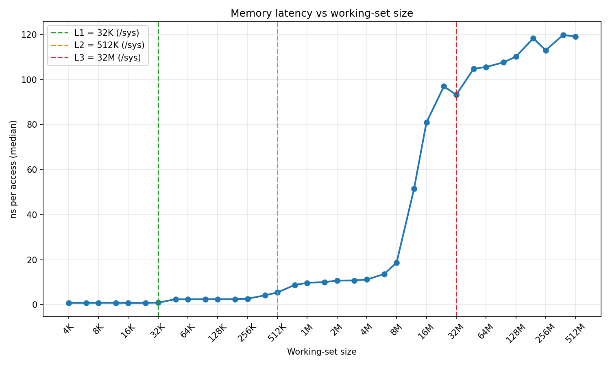

# cpuprobe
[](https://github.com/ishan-barot/cpuprobe/actions/workflows/ci.yml)
A C++ tool that measures how your CPU's memory hierarchy actually behaves (cache sizes, latencies, miss rates, IPC) using microbenchmarks and Linux hardware performance counters, with Python automation to sweep configs and plot results.



## Key findings (AMD Ryzen 9 5900X, Zen 3, WSL2, DDR4-2400)
- **L1d (32K):** 0.83 ns per access
- **L2 (512K):** ~2.45 ns, flat from 48K to 256K
- **L3 (32M per CCD):** ~10-11 ns from 1M to 4M
- **DRAM:** ~105-120 ns past 48M
- **TLB effect:** latency starts climbing around 8M, well before the 32M L3 edge. 8M is exactly what Zen 3's L2 TLB covers (2048 entries x 4K pages), so past that every load also pays for a page walk. Under WSL2 those walks are nested (guest page tables + Hyper-V's), which makes them extra expensive. Native Linux runs are next to separate the two effects.

## How it works
- **Pointer chasing:** each load depends on the previous one (`p = p->next`), so the CPU can't overlap loads, and random order defeats the hardware prefetcher. What's left is raw load-to-use latency.
- **Sattolo's algorithm:** a shuffle that always produces one single cycle, so the chase visits every node instead of getting stuck in a small loop that stays in cache.
- **One node per 64-byte cache line**, so every hop touches a new line.

## Methodology
- Release build (`-O2`), pinned to one core with `sched_setaffinity`
- One full warm-up lap before timing
- Each measurement runs for ~100 ms; the reported value is the median of 7 runs
- Sizes swept in powers of 2 plus 1.5x midpoints (4K, 6K, 8K, 12K...)

## Build and run
```bash
cmake -S . -B build -DCMAKE_BUILD_TYPE=Release
cmake --build build -j
./build/cpuprobe_tests
./build/cpuprobe info
./build/cpuprobe latency --min 4K --max 512M --cpu 2 --csv results/latency.csv
python3 scripts/plot.py results/latency.csv -o results/latency.png
```

## Limitations
- These results come from WSL2, a VM. Hardware counters aren't available there, and TLB misses cost more than on bare metal.
- RAM was running at 2400 MT/s (XMP/DOCP off); the kit is rated for 3600.

## Roadmap
- [x] Pointer-chase latency benchmark + cache info + plots
- [ ] Native Linux runs, DOCP on
- [ ] Hardware counters via `perf_event_open` (IPC, cache and branch misses)
- [ ] Comparison kernels: row vs column, branchy vs branchless, AoS vs SoA, false sharing
- [ ] CI on GCC and Clang with sanitizers
