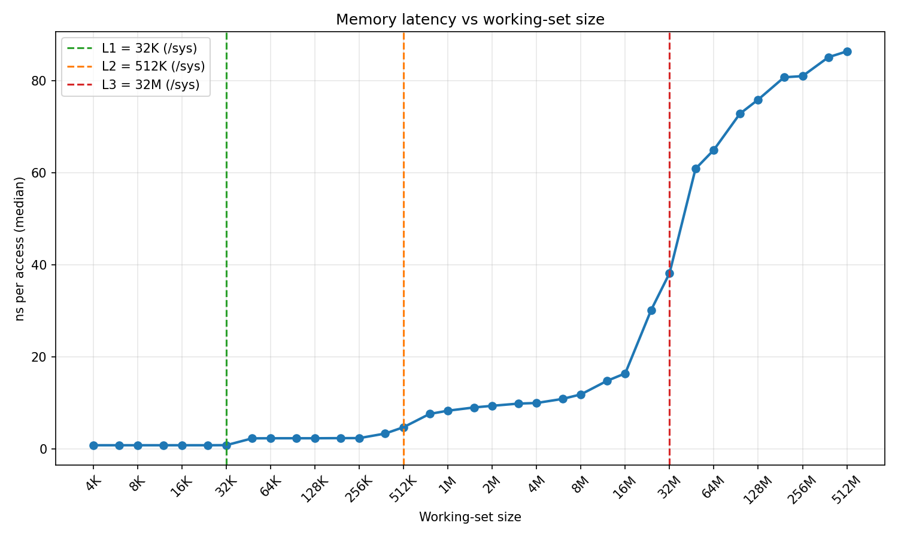
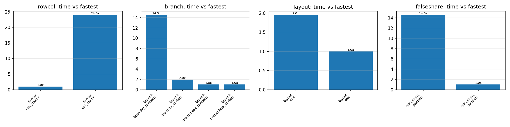
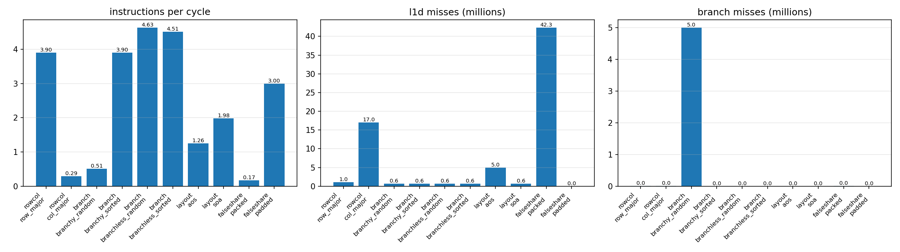

# cpuprobe
[](https://github.com/ishan-barot/cpuprobe/actions/workflows/ci.yml)

A C++ tool that measures how your CPU's memory hierarchy actually behaves (cache sizes, latencies, miss rates, IPC) using microbenchmarks and Linux hardware performance counters, with Python automation to sweep configs and plot results.

I built this because I wanted to expand on my interests from my computer architecture classes on my own machine instead of just reading about it. Turns out you can, and the hardware counters agree with the textbook.


## Key findings
Measured on a Ryzen 9 5900X (Zen 3), Ubuntu 24.04 under WSL2, DDR4-3600 CL17, gcc 13 `-O2`.

**Memory latency** (pointer chase, one core, median of 7 runs)

| Level | Size | Latency |
|---|---|---|
| L1d | 32K | 0.75 ns |
| L2 | 512K | 2.3 ns |
| L3 | 32M per CCD | 8 to 10 ns (1M to 4M) |
| DRAM | | ~86 ns |

The steps land right where `/sys` says each cache ends. Latency creeps up between 8M and 16M before the real L3 edge, which lines up with Zen 3's L2 TLB running out (2048 entries x 4K pages = 8M of coverage). Past that point every load also pays for a page walk. The L3 edge is at 32M even though the chip has 64MB total, because the 5900X is two chiplets with 32MB each and a pinned thread only sees its own.

**RAM speed matters.** My RAM had been running at 2400 MT/s because the memory profile (DOCP) was never turned on in the BIOS. Turning it on dropped DRAM latency from ~108 ns to ~86 ns, about 20% lower, without touching anything else. The old run is in the git history.

**Good vs bad code, with hardware counters**

| Kernel | Slowdown | What the counters show |
|---|---|---|
| Column-major vs row-major matrix sum (64MB) | **28.8x** | L1d misses go from 1.05M to 17.0M, IPC drops from 3.90 to 0.29 |
| Branchy loop on random vs sorted data | **7.6x** | Branch misses go from 23 to 5,000,127, IPC drops from 3.90 to 0.51 |
| Array of structs vs struct of arrays | **1.6x** | L1d misses go from 625K to 5.0M |
| False sharing: two cores writing to one cache line vs separate lines | **14.7x** | IPC drops from 3.00 to 0.17, 42M lines bounced between cores |




**The counters matched what I worked out on paper.** Before running, each miss count can be predicted:
- Row-major reads 64MB in 64-byte lines, so 64MB / 64B = 1,048,576 L1d misses. Measured: 1,048,915.
- Column-major jumps 16KB per step, so every one of the 16.7M loads should miss. Measured: 17.0M.
- 10M random bytes against a `>= 128` check means the predictor is right about half the time, so ~5M misses. Measured: 5,000,127.
- AoS drags 320MB through the cache (5M lines) to use 40MB; SoA reads just the 40MB (625K lines). Measured: 5.0M vs 625K.

## How it works
- **Pointer chasing.** Each load depends on the one before it (`p = p->next`), so the CPU can't overlap them, and the random order defeats the hardware prefetcher. What's left is raw load-to-use latency.
- **Sattolo's algorithm.** A shuffle that always produces one single cycle, so the chase visits every node instead of getting stuck in a small loop that stays in cache.
- **One node per 64-byte cache line**, so every hop touches a new line.
- **`perf_event_open`.** An RAII `PerfGroup` class opens a group of hardware counters (cycles, instructions, L1d misses, cache misses, branch misses) with the first one as group leader, so they all start and stop at the same instant. If the kernel has to multiplex counters, the values get scaled by `time_enabled / time_running` and flagged.
- **Keeping the comparisons honest.** Every good/bad pair has a unit test proving both versions compute the same result, and the branch benchmark needed an extra trick (see below).
- **False sharing.** Each thread pins itself to its own physical core and opens its own counter group, since perf counters only see the thread that opened them. The results get summed afterwards.

## The compiler is part of the experiment
The branch benchmark is supposed to show that a branch on random data is slow because the predictor keeps guessing wrong. Without any special handling, it doesn't show that at all:

| | branchy random | branchy sorted | branch misses (random) |
|---|---|---|---|
| plain `if` | 1.98 ms | 1.99 ms | 52 |
| `if` + `asm volatile("")` | 24.06 ms | 3.16 ms | 5,000,127 |

Disassembling the plain version with `objdump` shows why: gcc at `-O2` replaced the `if` with `cmovg` (a conditional move), so there was no branch left to mispredict. Putting an empty `asm volatile("")` inside the branch stops the compiler from doing that, and the 7.6x gap shows up. Good reminder to check the assembly before trusting a benchmark.

## Methodology
- Release build (`-O2`), never benchmarked with sanitizers on
- Pinned to one core with `sched_setaffinity` (false sharing uses cores 2 and 4, which are separate physical cores)
- One warm-up pass before timing
- Latency: each measurement runs ~100 ms and the reported value is the median of 7 runs
- Kernels: median of 5 runs, with counters taken from that same median run
- `scripts/run_sweep.py` records CPU model, kernel version, compiler, governor and git commit next to every result set (see `results/wsl/meta.json`)

## Build and run
```bash
cmake -S . -B build -DCMAKE_BUILD_TYPE=Release
cmake --build build -j
./build/cpuprobe_tests

./build/cpuprobe info                      # cache sizes from /sys
./build/cpuprobe latency --min 4K --max 512M --csv out.csv
./build/cpuprobe kernel all --counters     # or rowcol, branch, layout, falseshare

# full sweep + charts
python3 scripts/run_sweep.py --tag mybox --counters
python3 scripts/plot.py results/mybox/latency.csv -o results/mybox/latency.png
python3 scripts/plot_kernels.py results/mybox/kernels.csv -o results/mybox
```
If counters fail with a permission error, run `sudo sysctl kernel.perf_event_paranoid=1` (or `scripts/setup.sh`).

## Testing and CI
- 19 GoogleTest tests: Sattolo forms exactly one cycle, size parsing, stats, alignment, good/bad kernel pairs agree, counter sanity checks
- Counter tests skip themselves with `GTEST_SKIP` on machines without a PMU (like GitHub's runners)
- CI on every push: gcc and clang, Debug build with AddressSanitizer + UndefinedBehaviorSanitizer, all tests, a smoke run of every command, and a `clang-format` check

## Limitations
- These numbers come from WSL2, which is a Hyper-V VM. Counters work there on this machine, but page walks are nested (guest + host page tables), so TLB-heavy results are probably a bit worse than bare metal.
- Generic perf events map to different raw events on different CPU vendors. On Zen 3 the generic `cache-misses` event doesn't cleanly mean "L3 misses", so treat the `llc_misses` column as approximate. The L1d and branch counts line up with predictions almost exactly.
- No frequency control under WSL (no `cpupower`), so boost clocks can add some noise.

## What I learned
The compiler is part of the experiment. My branch benchmark first showed sorted and random data running at the same speed, which made no sense until the assembly showed `-O2` had already removed the branch. I also got into the habit of predicting a counter value before measuring it. When 5,000,127 branch misses showed up after I'd expected about 5M, I knew the tool was measuring what I thought it was. And sometimes the biggest speedup is a BIOS setting you forgot to turn on.

## Ideas for later
- Native Linux run compared against WSL2
- Core-to-core latency heatmap (same CCD vs across CCDs)
- Huge pages to show the TLB effect shrinking
- `-O0` / `-O2` / `-O3` / `-march=native` comparison
